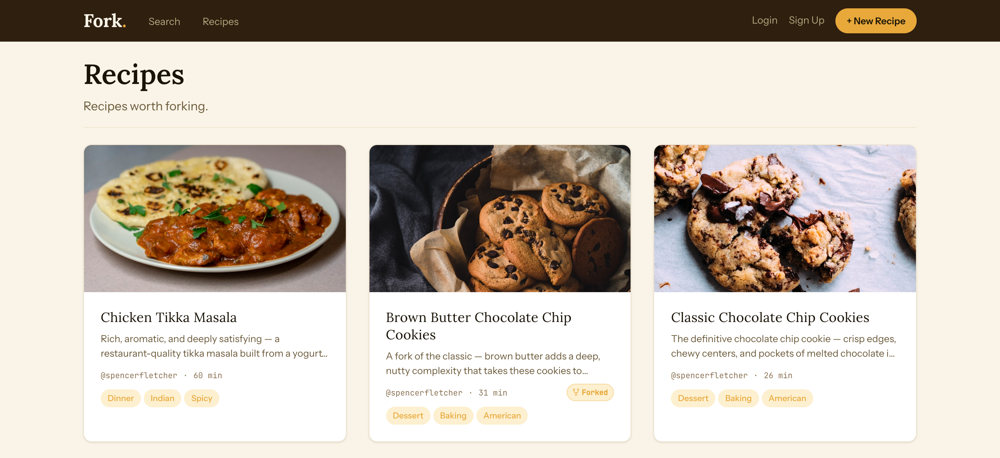
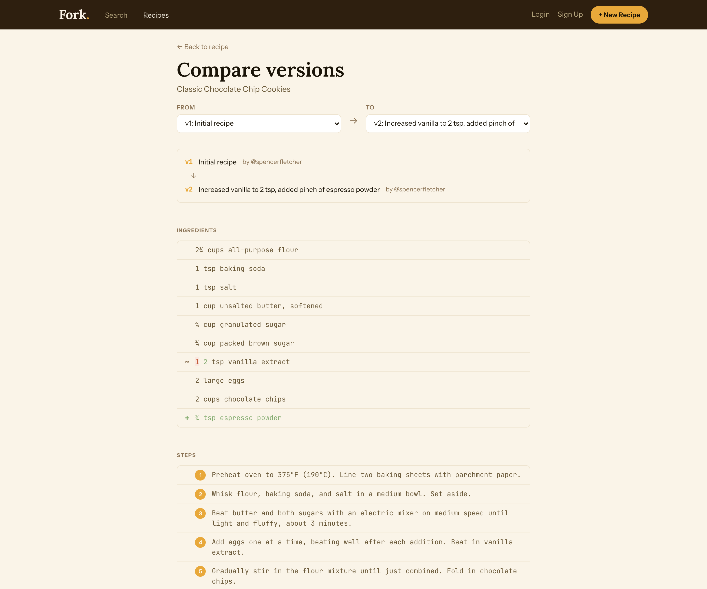
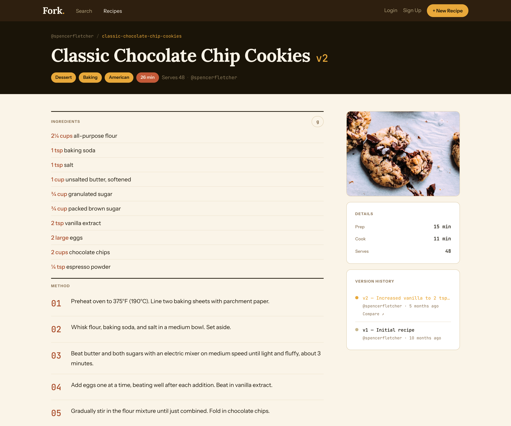

# Fork

A recipe platform that treats recipes the way git treats code: every edit is a version with a commit message, any recipe can be forked, and any two versions can be diffed.

**Live:** [recipes.spencerfletcher.com](https://recipes.spencerfletcher.com) · **Stack:** SvelteKit · TypeScript · PostgreSQL · Supabase



## Why

Home cooks modify recipes constantly and have no structured way to record what changed, why it changed, or who they got it from. Fork borrows the parts of version control that actually fit cooking — a history you can read, a fork that credits its source, and a diff that shows exactly which ingredient moved — and leaves out the parts that don't.

## The version control model

This is the core of the project, so it's worth being precise about what it does and doesn't do:

- **Linear versioning.** Each recipe has an append-only list of versions numbered `1..n`. Saving an edit writes a new `recipe_versions` row with a required commit message. Past versions are never mutated.
- **Forking.** Any public recipe can be forked into your own account. The fork records `parent_id` and `forked_at`, so attribution survives, and the recipe page shows a fork count and a link back to the source.
- **Diffing.** Any two versions of a recipe can be compared side by side. Ingredients are matched by name; steps are matched by position. Changed lines get a word-level inline diff so you can see `¾ cup` become `½ cup` without re-reading the row.



**There is no branching and no merging.** History is a straight line per recipe, and a fork is a copy with a pointer home — not a branch that can be merged back. Pull requests are on the roadmap below, not in the codebase.

A deliberate split in the schema supports this: recipe _metadata_ (title, description, image, times, servings) lives on the `recipes` row and is edited in place, while the _content_ that people actually iterate on (ingredients and steps) is versioned as JSONB in `recipe_versions`. Renaming a typo in the title shouldn't create a new version; swapping butter for oil should.



## Built

| Area       | What works                                                                                               |
| ---------- | -------------------------------------------------------------------------------------------------------- |
| Versioning | Version history per recipe, required commit messages, collapsible history UI, version-to-version compare |
| Diffing    | Ingredient and step diffs with word-level inline highlighting                                            |
| Forking    | Fork any public recipe, lineage via `parent_id`, fork counts, attribution on the recipe page             |
| Recipes    | Create, edit, image upload to Supabase Storage, public/private visibility                                |
| Discovery  | Postgres full-text search (`tsvector` + GIN) ranked with ingredient matching, tag pages, tag filtering   |
| Social     | Favorites, user profile pages with public recipes and a commit count                                     |
| Auth       | Email/password via Supabase Auth, SSR session handling, auth-gated routes and actions                    |
| Utility    | Ingredient-to-grams conversion from a local density table, with an optional Spoonacular fallback         |
| i18n       | English and Spanish message catalogs via Paraglide                                                       |

## Not built

Listed here so the roadmap isn't mistaken for the feature set. None of this exists in the codebase:

pull requests / recipe suggestions · merging · multi-hop lineage graphs · comments · following · collections · ratings · macros and price estimation · pantry search · any AI feature · recipe export

## Stack

| Layer          | Choice                                          |
| -------------- | ----------------------------------------------- |
| Framework      | SvelteKit 2 (Svelte 5 runes), TypeScript strict |
| Database       | PostgreSQL (Supabase)                           |
| ORM            | Drizzle                                         |
| Auth & Storage | Supabase Auth, Supabase Storage                 |
| Styling        | Tailwind CSS v4, Bits UI primitives             |
| i18n           | Paraglide (inlang)                              |
| Testing        | Vitest + Testing Library, Playwright            |
| Hosting        | Netlify                                         |

## Architecture

```
src/
  routes/
    +page.server.ts            public recipe feed
    recipes/
      [slug]/                  recipe detail, colocated presentational components
      [slug]/edit/             edit form; writes a new version on save
      [slug]/diff/             version comparison
      new/                     create + image upload
    search/                    full-text search
    tags/[slug]/               recipes by tag
    users/[username]/          public profile
    api/convert-to-grams/      ingredient unit conversion
  lib/
    server/db/schema.ts        Drizzle schema — single source of truth
    server/db/seed.ts          demo data
    utils/diff.ts              pure diff logic (unit tested in isolation)
    validation/                server-side input validation
    components/                shared components
```

Load functions and form actions do the data work; `hooks.server.ts` attaches the Supabase client and the user to `event.locals` on every request. The diff engine in `lib/utils/diff.ts` is deliberately free of framework and database dependencies, which is why it's the most heavily tested file in the repo.

Tables: `profiles`, `recipes`, `recipe_versions`, `tags`, `recipes_to_tags`, `favorites`.

## Running locally

**Prerequisites:** Node 22, pnpm 10, Docker (for local Supabase).

```bash
git clone https://github.com/spencerfletcher/Fork.git
cd Fork
pnpm install
cp .env.example .env
```

Start Supabase and apply the schema:

```bash
supabase start                 # prints your local API URL, anon key, and service role key
# paste those into .env, then:
pnpm db:push                   # apply the Drizzle schema
pnpm db:seed                   # demo user + three recipes, one a fork with two versions
pnpm dev
```

The app runs at `http://localhost:5173`. The seeded account is `spencer@fork.dev` with the password from `SEED_USER_PASSWORD` (default `Fork-Demo-2025!`).

To point at a hosted Supabase project instead, skip `supabase start` and fill `.env` from your project's dashboard — `DATABASE_URL` should be the **pooler** connection string (port 6543), not the direct one, since serverless functions exhaust direct connections.

## Testing

```bash
pnpm test:unit run   # 132 unit + component tests (Vitest)
pnpm test:e2e        # Playwright; requires a seeded database
pnpm check           # svelte-check
pnpm lint            # eslint + prettier
```

Unit tests live next to their source (`Foo.svelte` → `Foo.svelte.test.ts`). Server logic runs in a Node environment, component tests in jsdom; the split is configured in `vitest.workspace.ts`. CI runs type checking, linting, and the unit suite on every push. The Playwright suite needs a live seeded database and is currently run locally rather than in CI.

## License

MIT — see [LICENSE](LICENSE).
